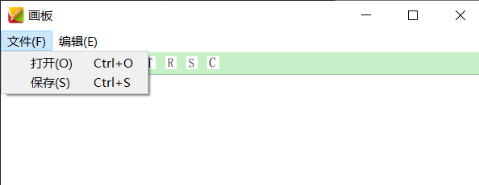
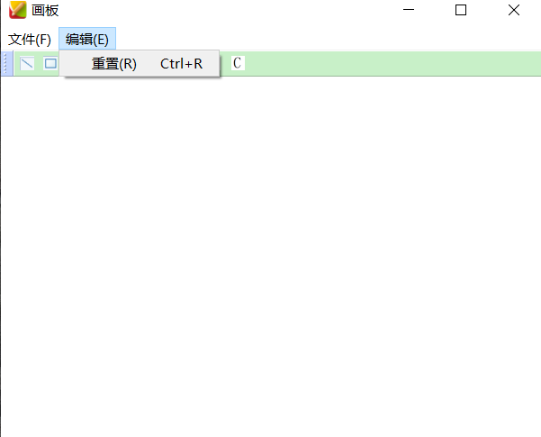

# 系统使用说明书
1. 开发环境说明  
windows平台下的qt开发框架(Qt Creator 4.9.0 (Enterprise))，使用的是C++语言。
2. 代码编译说明  
windows平台下使用qmake工具进行编译。
3. 程序运行说明  
* 文件输入接口：windows环境下打开命令行，定位到可执行程序目标文件夹，执行CG.exe 输入文件名 保存文件目录即可，如下图：  
  
其中F:\12月是在我的电脑上CG.exe存在的文件夹，后面依次是输入文件名，保存文件目录，注意到在我的电脑上输入文件名和保存文件目录文件夹名称不能含中文，所以使用时文件夹尽量命名成英文，这里的input.txt是助教所给样例，运行结果为：  

至于文件中语句的格式，除了多边形和曲线绘制语句占据2行以外，其余都是1行，具体语句格式按助教所给样例在windows平台下采用UTF-8编码  

* 用户交互接口  
windows环境下打开命令行，定位到可执行程序目标文件夹，执行CG.exe或者直接在可执行文件所在文件夹中点击CG.exe文件即可。  

  
点击上述的图元，可绘制对应的图元  

    * 绘制直线：鼠标左键点击并拖住移动生成一条直线  
    
    * 绘制矩形：鼠标左键点击并拖住移动生成一个矩形
    
    * 绘制椭圆：鼠标左键点击并拖住移动生成一个椭圆
    
    * 绘制多边形：鼠标左键点击并拖住移动形成多边形的第一条边，接着点下多个点(点完只要不放则可拖动)，依次相连形成多边形，当第一个点与最后一个点在某种允许的误差内重合时，多边形绘制结束，期间若多边形未绘制结束点击工具栏中任一操作，则多边形强制绘制结束。
    
    * 绘制曲线：鼠标左键依次点击多个点成为控制点，根据控制点采用Bezier算法生成曲线，如果要终止曲线的绘制，可以点击工具栏中任一操作，包括绘制曲线操作和选择颜色操作。
    
    * 选择颜色：
      
    鼠标点击上面的操作，弹出下面选择颜色的对话框
    
    自由选择颜色，这里设置red为50，green为150，blue为200，绘制图元如下
    
    * 平移、旋转、缩放、裁剪操作  
      
    T表示translate，R表示rotate，S表示scale，C表示clip，所有操作都只能针对于最新的图元  
        * 平移操作：点击T，将会以短线-点的形式生成最新图元的外接矩形(曲线是其控制点组成多边形的外接矩形)  
          
        在矩形内部点击一点，拖动则可以将图元进行平移  
        
        * 旋转操作：点击R，将会出现一个红色矩形的点，即为旋转中心，可以通过鼠标左键的点击更换旋转中心，接着滚动滚轮，滚轮向外侧滚动一格则顺时针旋转1度，向内侧滚动一格则逆时针旋转1度。  
        注意：图元旋转过多会导致失真，尤其是多边形
        
        
        * 缩放操作：点击S，将会出现一个蓝色矩形的点，即为缩放中心，可以通过鼠标左键的点击更换缩放中心，接着滚动滚轮，滚轮向外侧滚动则放大，反之则缩小。  
        注意：图元缩放过小会导致在某些角度无法再放大，这些与计算时的误差相关。
        
        
        * 裁剪操作：点击C，接着鼠标拖动形成一个矩形区域，以短线-点的形式展现，该区域即为裁剪区域。
        注意：如果点击画板上的一个点再松开，则图元会消失，因为此时裁剪区域为一个点
        
        
    * 菜单中的文件(F)操作  
      
        * 点击打开会跳出文件打开对话框，默认文件目录为上级目录，可以选择需要打开的指令文件，效果同文件输入接口方式相同，这里不加赘述。 
        * 点击保存会跳出文件保存对话框，默认文件目录为上级目录，可以选择保存文件的目录，并将当前画板自命名保存在该目录下。
        
        比如，将上面这个保存并命名为"高伟.png"。
        在上层文件目录中找到了"高伟.png"文件。  
          
    * 菜单中的编辑(E)操作
    
        * 点击重置会跳出如下对话框  
        
        输入高度和宽度，点击确认，则会清空当前画板并重新设置宽度和高度，点击取消则不进行任何操作。
    